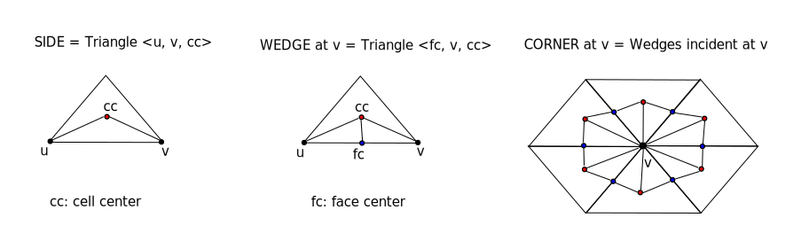

# Wonton Concepts      {#concepts}

## Wrappers
Mesh and state or data associated with the mesh are fundamental
data structures in any physics based application. In general,
the application has its own native data structures with
its native interface for data access. 

This makes it harder to design generic libraries that can work
with different applications with different native APIs. One way 
to overcome this problem is to access data through a wrapper. 
A wrapper is an implementation of an interface to the native 
interface and can be used to avoid data copy between application 
and the library if the wrapper interface provides the essential 
queries required by the library.   

Both Portage and Tangram are templated on mesh and state wrapper
types ensuring that any application code can use them regardless
of their native API while avoiding data copy. 

Wonton primarily serves two purposes: 
1. It defines a common interface to access mesh and field data
from any application.
2. It serves as a repository of example wrappers, specifically to 
the Jali mesh framework, FleCSI Burton Mesh Specialization and 
couple of native mesh/state wrappers.  

We now describe the common interface and its design.  

### Mesh Wrapper Design 
The mesh wrappers are designed to use a Curiously Recurring Template Pattern 
(CRTP) over a base class called _AuxMeshTopology_. The basic mesh 
wrapper for a particular framework implements methods for various mesh 
queries. We will discuss the motivation and use for using CRTP design in
the next section. Here we provide an overview of what methods the basic
mesh wrapper must provide. 

The wrapper class must support cells, faces and nodes and adjacency
queries between these entities. In 2D, faces are the same as edges
and in 1D, faces are the same as nodes. The mesh wrapper class is expected
to support the following methods:

1. Basic 

    * int space\_dimension() const;  // dimensionality of mesh points (1, 2, 3)

    * int num\_owned\_cells() const;

    * int num\_ghost\_cells() const;

    * int num\_owned\_faces() const;

    * int num\_ghost\_faces() const;

    * int num\_owned\_nodes() const;

    * int num\_ghost\_nodes() const;

    * int get\_global\_id(int const id, Entity\_kind const kind) const;

2. Type information (see for details on Wonton types) 

    * Wonton::Entity\_type cell\_get\_type(int const cellid) const;

    * Wonton::Entity\_type node\_get\_type(int const nodeid) const;

    * Wonton::Element\_type cell\_get\_element\_type(int const cellid) const;

3. Topology queries
    * void cell\_get\_faces\_and\_dirs(int const cellid, std::vector<int> \*cfaces,
                              std::vector<int> *cfdirs) const;
      Here the cfdirs conveys the directions in which the faces are used by
      the cell. If the natural normal of the face points out of the cell, its
      direction should be returned as 1, if not, it should be returned as -1

    * void cell\_get\_nodes(int const cellid, std::vector<int> \*cnodes) const;

    * void face\_get\_nodes(int const faceid, std::vector<int> \*fnodes) const;

    * void node\_get\_cells(int const nodeid, Wonton::Entity\_type etype,
                     std::vector<int> *ncells) const;

    * template<long D> void node\_get\_coordinates(int const nodeid, Wonton::Point<D> \*pp) const;

### AuxMeshTopology

The basic mesh wrapper provides access to the standard 
entity types and their topological and geometrical information.
However, advanced non-standard types such as _sides_, _corners_, etc.,
may not be provided by the mesh framework. Such advanced types are
required for some particular algorithms such as nodal remapping, 
remapping methods for entities with non-planar faces, etc. 

Using the CRTP design allows extending the base mesh to 
support construction of such advanced topological types. 
Since AuxMeshTopology needs to make some queries about the basic 
topology, CRTP is used to allow this kind of mutual invocation 
from the Derived wrapper type.

Using the CRTP design, the basic mesh framework wrapper looks something like

~~~{.cc}
class Basic_Mesh_Wrapper : public AuxMeshTopology<Basic_Mesh_Wrapper> {...};
~~~

In this way, the `Basic_Mesh_Wrapper` can use its own methods, or
defer to AuxMeshTopology to perform more advanced queries. 

The definitions of the non-standard subcell entities that the AuxMeshTopology
constructs are as follows: 
* 1D: A side is a line segment from a node to the cell. Wedges and corners are the same
as the sides. 
* 2D: A side is a triangle formed by the two nodes of an edge/face and the cell center.
A wedge is half of a side formed by one node of the edge, the edge center and the 
cell center. A corner is a quadrilateral formed by the two wedges in a cell at a node. 
* 3D: A side is a tet formed by the two nodes of an edge, a face center and a cell center. 
A wedge is half a side, formed by a node of the edge, the edge center, the face 
center and the cell center. A corner is formed by all the wedges of a cell at a node.

In addition to the advanced mesh entities (sides, wedges, and
corners), AuxMeshTopology also computes some advanced connectivity
information.  An example is Wonton::AuxMeshTopology::node_get_cell_adj_nodes(), 
which, given a node index in the mesh, returns a vector of all 
the nodes that are attached to all cells attached to the given node.  
AuxMeshTopology additionally creates iterators over all the various 
types of mesh entities, provides geometric information (e.g. volumes, 
centroids, etc.) of the mesh entities, and a method to determine if 
an entitiy is on the domain boundary (needed for limiting in higher-order remaps).

_If one does **not** use AuxMeshTopology to help extend their mesh
wrapper's functionality, one should ensure that their mesh wrapper at
least has the same public functions as AuxMeshTopology._ For this
reason, it is advised to utilize AuxMeshTopology where possible, but
to defer to one's own mesh framework wrapper when more efficient
methods are available.

### Current Support 
At present, Wonton provides the following wrappers to external frameworks:
1. [Jali](http://github.com/lanl/jali)
2. [FleCSI Burton Specialization](http://github.com/laristra/flecsi-sp)

Wonton also provides two native mesh and state managers and their wrappers: 
1. [Simple Mesh and State](@ref example): A very light-weight, serial, 2D/3D Cartesian mesh and its state. 
3. Flat Mesh and State: A native framework used internally for redistributing mesh/state
                        data across partitions.   

### State Wrappers
There is no equivalent of AuxMeshTopology for state wrappers.  This is
simply because the requirements of a state manager are much less
than those of the mesh framework.  In particular, the state
wrappers need to know how to add data, get data, and query things
like the size of the data and where the data lives (Wonton::CELL or
Wonton::NODE). 

## Types
Wonton currently provides the following enumerated types:
1. _Entity\_kind_: The type of mesh entity. 
    * ALL\_KIND, ANY\_KIND, UNKNOWN\_KIND, NODE, EDGE, FACE, 
CELL, SIDE, WEDGE, CORNER, FACET, BOUNDARY\_FACE, PARTICLE  

2. _Entity\_type_: The parallel type of a given entity. 
    * TYPE\_UNKNOWN, DELETED, PARALLEL\_OWNED, PARALLEL\_GHOST, BOUNDARY\_GHOST, ALL

3. _Element\_type_: The cell type
    * UNKNOWN\_TOPOLOGY, TRI, QUAD, POLYGON, TET, PRISM, PYRAMID, HEX, POLYHEDRON

4. _Field\_type_: Whether the state i.e. the field is a mesh or multi-material field. 
    * UNKNOWN\_TYPE\_FIELD, MESH\_FIELD, MULTIMATERIAL\_FIELD

Wonton also provides types for Points, Vectors and Matrices. These are advanced types
with the following operators and methods: 

* Point:
    - Operators: \[\], -p, p+t, c\*p, p/c
    - Methods: asV (convert Point to Vector) 
* Vector:
    - Operators: \[\], -V, V+U, V-U, sV, V/s, 
    - Methods: norm, one\_norm, max\_norm, normalize, is\_zero, dot, cross, MaxComponent 
* Matrix: 
    - Initialization: Using constant value, from vector of vectors, copy
    - Operators: M = M + C, M = M - C, M = c\*M, \[\], M = M\*_v_, M = A\*B
    - Methods: inverse, solve (QR decomposition based), data (return matrix data)  

## Algorithms

* SVD:  Double precision SVD routine. Takes an m-by-n matrix A and 
decomposes it into UDV, where U, V are left and right orthogonal transformation 
matrices, and D is a diagonal matrix of singular values. 

* lsfits: Computes a least squares gradient from a set of values. The first
  point is assumed to be the point where the gradient must be computed
  and the first value is assumed to the value at this reference point. 

